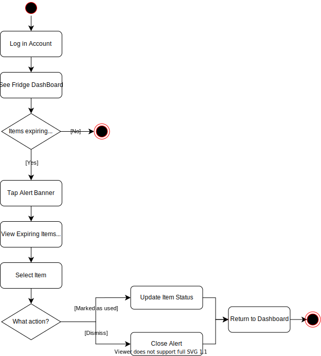

# Specification Phase Exercise

A little exercise to get started with the specification phase of the software development lifecycle. See the [instructions](instructions.md) for more detail.

## Team members

See instructions. Delete this line and replace with a list of the names of your team members, including links to each one's GitHub profile.

## Stakeholders

See instructions. Delete this line and replace with the name(s) of the stakeholder(s) you interviewed and lists showing their goals/needs, and problems/frustrations.

## Product Vision Statement

See instructions. Delete this line and place your Product Vision Statement here.

## User Requirements

### Individual User

1. As an individual user, I want to create an account so that my fridge data is saved and accessible from any device.
2. As an individual user, I want to log in with my email or third-party accounts (Google, Apple) so that I can access my fridge quickly.
3. As an individual user, I want to reset my password so that I can recover my account if I forget it.
4. As an individual user, I want to add food items to my fridge so that I can track what I have.
5. As an individual user, I want to edit food item details (name, category, expiration date) so that information stays accurate.
6. As an individual user, I want to delete food items so that I can remove things I have used or thrown away.
7. As an individual user, I want to search for items in my fridge so that I can quickly find what I need.
8. As an individual user, I want to filter items by category (meat, dairy, vegetables, beverages) so that I can browse my fridge more easily.
9. As an individual user, I want to sort items by expiration date so that I can see what needs to be used first.
10. As an individual user, I want to receive expiration alerts so that I don't waste food.
11. As an individual user, I want to ask AI Cook for recipe suggestions based on my fridge contents so that I know what to cook.
12. As an individual user, I want to set my eating preferences (allergies, dietary restrictions) so that AI Cook gives me relevant suggestions.
13. As an individual user, I want to create multiple fridges so that I can track different locations (home fridge, office fridge).
14. As an individual user, I want to switch between my fridges so that I can manage them separately.

### Group User

1. As a group fridge user, I want to label items as mine or shared so that everyone knows what they are allowed to take.
2. As a group fridge user, I want to see who owns each item so that I don’t accidentally take someone else’s food.
3. As a group fridge user, I want to locate my items easily so that I don’t mistake other people’s food for mine.
4. As a group fridge user, I want to know whether shared items are finished so that I can plan groceries accordingly.
5. As a group fridge user, I want to view a simple activity history so that fridge usage feels transparent.
6. As a group fridge user, I want to leave notes on items (like “don’t eat” or “for dinner”) so that we avoid misunderstandings.
7. As a group fridge user, I want to notify others when food needs to be eaten soon so that we reduce waste.
8. As a group fridge user, I want to announce when I add shared food so that others know it is available.
9. As a group fridge user, I want to flag spoiled food so that someone can remove it quickly.
10. As a group fridge user, I want to mark items as thrown away so that others don’t look for them afterwards.
11. As a group fridge user, I want to be notified when someone edits or removes my items so that I stay informed.
12. As a group fridge user, I want to invite or remove members from the fridge group so that only authorized people have access.
13. As a group fridge user, I want to manage shared rules (like shelf usage or food categories) so that everyone follows the same system.

## Activity Diagrams

See instructions. Delete this line and place images of your UML Activity diagrams here.

### Individual User

**User Story #8:** As an individual user, I want to filter items by category (meat, dairy, vegetables, beverages) so that I can browse my fridge more easily.

 

**User Story #10:** As an individual user, I want to receive expiration alerts so that I don't waste food. 

## Clickable Prototype

See instructions. Delete this line and place a publicly-accessible link to your clickable prototype here.
