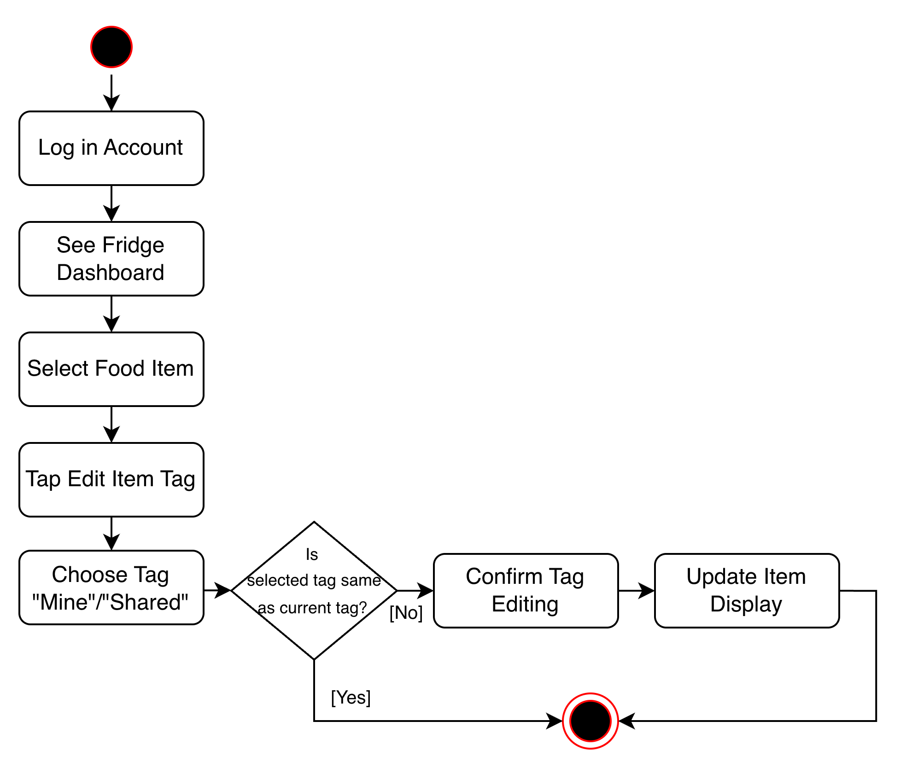
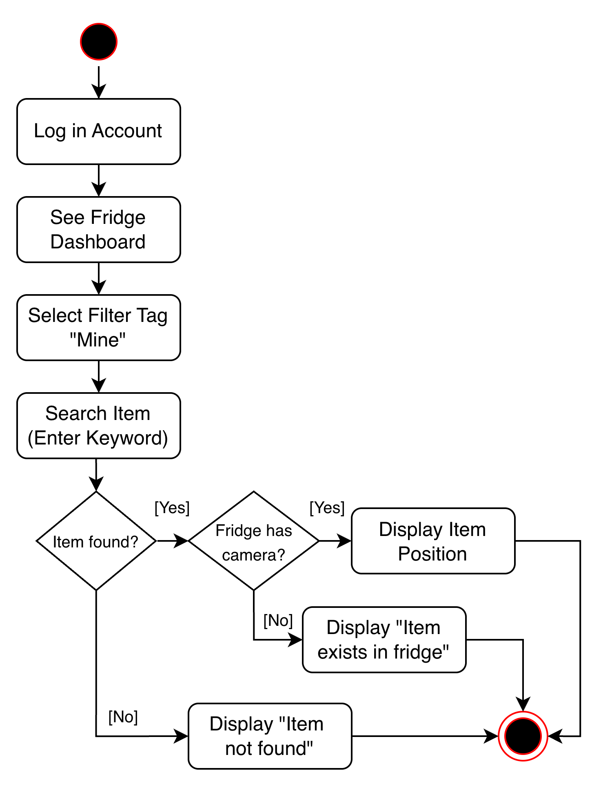

# Specification Phase Exercise

A little exercise to get started with the specification phase of the software development lifecycle. See the [instructions](instructions.md) for more detail.

## Team members

* [Mumu Li](https://github.com/n3xta)
* [Tae Kim](https://github.com/thk224)
* [Xiongfeng Li](https://github.com/DaobaRoger12)
* [Celia Liang](https://github.com/liangchuxin)

## Stakeholders

We conducted interviews with college students, roommates, and family members to understand the distinct needs of individual users versus those living in shared environments.

### 1. The Individual User
**Representative:** *The Busy Student / The Vegetarian Professional / The Content Creator*
A user managing their own diet and budget. They are often tired after work/school and prone to ordering takeout if cooking feels too complicated.

**Goals & Needs**
* **Inventory-Based Recipes:** Wants the app to suggest recipes based *strictly* on what is currently in stock (e.g., "You have spinach and chicken") to avoid going to the store.
* **Visual Freshness Indicators:** Needs a "Visual Countdown" (Green/Yellow/Red indicators) to gamify freshness and instantly see what needs to be eaten first.
* **Dietary Personalization:** Needs to filter recipe suggestions by diet (e.g., Vegetarian) and exclude allergens automatically so they don't have to read every ingredient list.
* **Offline Access:** Wants to view their fridge inventory and shopping list even without a signal, specifically when deep inside a supermarket.
* **Consumption History:** Wants to look back at what they cooked last week (like a food diary) to repeat successful meals and track their own nutrition.

**Problems & Frustrations**
* **Short Shelf Life:** Buys healthy ingredients (e.g., organic products) with good intentions, but lets them spoil because the pan isn't washed or they are too tired to cook.
* **Fridge Blindness:** Items get pushed to the back of the fridge and are forgotten; they are only discovered when they smell bad.
* **Decision Fatigue:** The hardest part of cooking isn't the labor, but the mental exhaustion of deciding *what* to cook every single day.
* **Duplicate Buying:** Often buys items (like spices or jars of sauce) that they already have at home because they didn't check the cabinet before shopping.
* **Unhealthy Default:** When they don't know what to cook, they default to instant noodles or unhealthy snacks, even if they have fresh food available.

### 2. The Group User
**Representative:** *The Roommate / The Family Member*
A user managing a fridge shared by multiple people. This includes roommates splitting costs or parents monitoring their children's nutrition.

**Goals & Needs**
* **Ownership Labeling:** Needs to clearly label items as **"Mine"** (Private) vs. **"Shared"** (Community) to establish boundaries in a shared space.
* **Remote Monitoring:** Wants to know if family members are eating properly (e.g., checking if the "balanced meal" ingredients were used) without having to nag them.
* **Replenishment Alerts:** Wants to know immediately when shared staples (like milk or eggs) run low so the next person coming home can buy more.
* **Activity Transparency:** Wants a log of who added or removed items to ensure financial fairness and transparency in shared living.
* **Standardized Rules:** Wants to set category rules (e.g., "Top shelf is for leftovers") so that everyone follows the same organization system.

**Problems & Frustrations**
* **Accidental Theft:** Roommates often eat leftovers or expensive ingredients because they mistakenly thought they were "community food."
* **Vague Communication:** Family members give dismissive answers when asked "What did you eat?", making it hard to track nutrition.
* **Inconsistent Storage:** One person puts raw meat next to cooked vegetables, or puts dairy in the door (where it spoils), causing safety concerns.
* **Spoilage Blame:** When something rots in a shared fridge, no one takes responsibility to throw it out, so it stays there for weeks.
* **Double Purchasing:** Multiple people buy the same perishable item (e.g., three cartons of milk) because they didn't communicate, leading to waste.

## Product Vision Statement

For busy individuals and communal living environments who struggle with food waste and disorganized kitchens, ***Better Fridge*** is a smart inventory and collaboration app that automates expiration tracking, simplifies meal decisions, and coordinates shared responsibilities.

## User Requirements

### Individual User

1. As an individual user, I want to create an account so that my fridge data is saved and accessible from any device.
2. As an individual user, I want to log in with my email or third-party accounts (Google, Apple) so that I can access my fridge quickly.
3. As an individual user, I want to reset my password so that I can recover my account if I forget it.
4. As an individual user, I want to add food items to my fridge so that I can track what I have.
5. As an individual user, I want to edit food item details (name, category, expiration date) so that information stays accurate.
6. As an individual user, I want to delete food items so that I can remove things I have used or thrown away.
7. As an individual user, I want to search for items in my fridge so that I can quickly find what I need.
8. As an individual user, I want to filter items by category (meat, dairy, vegetables, beverages) so that I can browse my fridge more easily.
9. As an individual user, I want to sort items by expiration date so that I can see what needs to be used first.
10. As an individual user, I want to receive expiration alerts so that I don't waste food.
11. As an individual user, I want to ask AI Cook for recipe suggestions based on my fridge contents so that I know what to cook.
12. As an individual user, I want to create multiple fridges so that I can track different locations (home fridge, office fridge).
13. As an individual user, I want to switch between my fridges so that I can manage them separately.

### Group User

1. As a group fridge user, I want to label items as mine or shared so that everyone knows what they are allowed to take.
2. As a group fridge user, I want to see who owns each item so that I don’t accidentally take someone else’s food.
3. As a group fridge user, I want to locate my items easily so that I don’t mistake other people’s food for mine.
4. As a group fridge user, I want to know whether shared items are finished so that I can plan groceries accordingly.
5. As a group fridge user, I want to leave notes on items (like “don’t eat” or “for dinner”) so that we avoid misunderstandings.
6. As a group fridge user, I want to notify others when food needs to be eaten soon so that we reduce waste.
7. As a group fridge user, I want to announce when I add shared food so that others know it is available.
8. As a group fridge user, I want to flag spoiled food so that someone can remove it quickly.
9. As a group fridge user, I want to mark items as thrown away so that others don’t look for them afterwards.
10. As a group fridge user, I want to be notified when someone edits or removes my items so that I stay informed.
11. As a group fridge user, I want to manage shared rules (like shelf usage or food categories) so that everyone follows the same system.

## Activity Diagrams

### Individual User

**User Story #8:** As an individual user, I want to filter items by category (meat, dairy, vegetables, beverages) so that I can browse my fridge more easily.

 

**User Story #10:** As an individual user, I want to receive expiration alerts so that I don't waste food. 

### Group User

**User Story #1:** As a group fridge user, I want to label items as mine or shared so that everyone knows what they are allowed to take.

 

 **User Story #3:** As a group fridge user, I want to locate my items easily so that I don’t mistake other people’s food for mine.

 

## Clickable Prototype

[Clickable Prototype of Better Fridge](https://www.figma.com/proto/67LxaMQ52kScxfdWNGZHaD/Better-Fridge---Supernova?node-id=5-177&t=3V3UuV1PpNY93DmB-0&scaling=scale-down&content-scaling=fixed&page-id=2%3A338&starting-point-node-id=5%3A177)